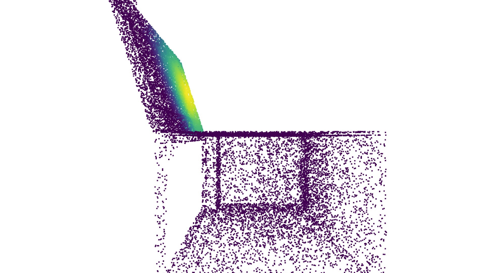

# Get Collision Map:
Run get_collision_map.py 

Please check "if_save" and "save_path" carefully

# Show Collision Buffer:

Run show_buffer_dynamic.py
show_buffer_silent.py

The object and the buffer of it will be shown in IsaacGym environment!